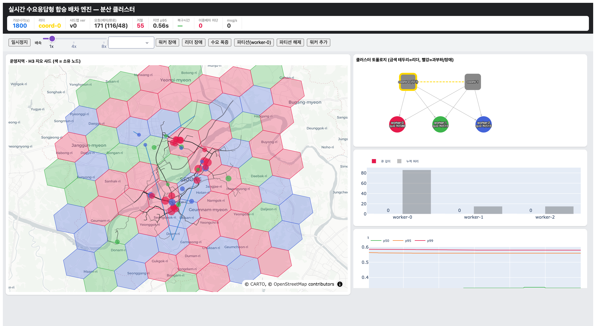

# drt-dispatch-sim

**실시간 수요응답형 합승 배차 엔진 시뮬레이터 — 분산 시스템 중심**

승객 호출이 실시간으로 들어올 때 여러 차량에 합승 경로를 짜서 배차하는 엔진을, 도시
규모로 **여러 서버가 지역을 나눠 처리하고 서버가 죽어도 무중단으로** 도는 분산 시스템으로
구현한 시뮬레이터다. 주인공은 배차 알고리즘이 아니라 **지오 샤딩·리더 선출·장애 복구·
백프레셔 같은 분산 조율**이며, 코드를 몰라도 동작을 바로 이해할 수 있게 대시보드로
시각화한다.



---

## 빠른 시작

```bash
python -m venv .venv && source .venv/bin/activate
pip install -e .            # 실제 도로 라우팅까지: pip install -e ".[osm]"
python -m drt_sim.cli dashboard --config config/default.yaml
# 브라우저에서 http://127.0.0.1:8050
```

대시보드의 컨트롤 버튼을 눌러 보면:
- **워커 장애**: 죽은 서버가 맡던 H3 셀이 살아있는 서버 색으로 다시 칠해진다(샤드 이전).
- **리더 장애**: 리더 표시가 다른 관리 서버로 옮겨간다(리더 재선출).
- **수요 폭증**: 큐 깊이 막대가 차올랐다 회복된다(백프레셔).

---

## 대시보드에서 보이는 것

- **지도**: 실제 도로 지도 위에 H3 셀을 담당 서버별 색으로 표시. 차량은 서버색 점(탑승
  인원이 많을수록 큼), 경로는 도로를 따라가는 선. 서버가 죽으면 그 셀이 다시 칠해진다.
- **클러스터 토폴로지**: 관리 서버 + 워커 그래프. 리더는 금색 테두리, 과부하는 빨강,
  장애는 회색 점선. 서버별 큐 깊이/처리량 표시.
- **차트**: 배차 지연 p50/p95/p99, 서버별 큐 깊이.
- **컨트롤**: 노드/리더 장애, 네트워크 파티션, 수요 폭증, 워커 추가, 재생/배속.

---

## 구현한 분산 메커니즘

- **지오 샤딩** — 운영지역을 H3 셀로 나눠 HRW(rendezvous) 해싱으로 서버에 배정. 서버가
  추가/제거돼도 그 서버의 셀만 이동한다(최소 마이그레이션).
- **이중 배차 방지** — 차량별 단일 라이터 + 버전 기반 낙관적 동시성. 두 서버가 같은 차를
  동시에 배차할 수 없다.
- **리더 선출 / 페일오버** — lease 기반 리더 선출. 리더가 죽으면 다른 관리 서버가 승격.
- **장애 감지 + 샤드 리밸런싱** — 하트비트로 워커 장애를 감지하고, 죽은 서버의 셀과 차량
  소유권을 살아있는 서버로 무중단 재할당.
- **백프레셔** — 워커 큐가 고수위를 넘으면 코디네이터로 흘려보내고(spill) 메터링 재주입.
- **at-least-once + 멱등성** — 메시지가 중복 전달돼도 request_id 로 한 번만 배차.
- **결정론적 가상시간 런타임** — 가상 시계로 돌려 시드만 같으면 결과가 완전 재현된다.
- **진짜 분산 모드** — 같은 actor 코드를 실제 asyncio 루프(live)와 실제 OS 프로세스 +
  Redis(redis 모드)에서도 돌릴 수 있다.

배차는 견고한 휴리스틱 수준으로 유지한다: 온라인 삽입(insertion) 합승 + 가상 정류장 스냅 +
전 승객 우회/대기 제약 + 유휴 차량 리밸런싱.

---

## 아키텍처

```
   Gateway ──ride_req──► Dispatch Workers ──commit──► Vehicle Store
   (수요발생)            (샤드별 매칭)               (단일 라이터+버전)
       ▲                      │ heartbeat                 ▲
       │ cluster_state        ▼                           │ 복제
       └──────────────  Coordinator (리더 선출·리밸런싱·백프레셔)
                              │
   Message Bus (SimBus/RedisBus)        World (차량 도로 이동·픽업/하차)

   모든 컴포넌트는 하나의 Runtime(결정론적 가상시간 스케줄러) 위의 async actor.
```

```
src/drt_sim/
  sim_clock.py / async_runtime.py   # 가상시간 / wall-clock asyncio 런타임
  bus/                              # 메시지 버스 (sim / redis)
  sharding.py store.py              # HRW 샤딩 / 차량 스토어(이중 배차 방지)
  coordinator.py worker.py          # 리더 선출·리밸런싱 / 샤드 매칭
  gateway.py world.py               # 수요 발생 / 차량 물리(도로 이동)
  dispatch/ routing.py geo.py       # insertion·가상정류장 / 도로 라우터 / H3
  cluster.py live_cluster.py cluster_redis.py   # 3가지 실행 모드
  viz/ cli.py config.py             # Dash 대시보드 / CLI / 설정
config/ scenarios/ tests/ data/
```

---

## 명령어

```bash
python -m drt_sim.cli dashboard --config config/default.yaml      # 대시보드
python -m drt_sim.cli run       --scenario scenarios/demand_surge.yaml   # 배치 + 메트릭
python -m drt_sim.cli baseline  --config config/default.yaml --duration 1200  # 합승 vs 비합승
python -m drt_sim.cli scaling   --config config/default.yaml --workers 1,2,4,6 # 확장성
python -m drt_sim.cli pareto    --config config/default.yaml --html pareto.html # 우회↔효율 곡선
python -m drt_sim.cli cluster   --mode live   --virtual-seconds 60       # asyncio 실행
python -m drt_sim.cli cluster   --mode redis  --workers 3 --kill-at 4    # 실제 OS 프로세스(redis 필요)
pytest -q                                                                # 테스트
```

**시나리오** (`scenarios/`): `node_failure`, `demand_surge`, `leader_failover`,
`network_partition`. 모두 YAML 주도이며 `seed` 로 재현된다.

---

## 결과 (`baseline --duration 1200`)

| 지표 | 합승(insertion) | 비합승(baseline) |
|---|---|---|
| 매칭률 | **99%** | 47% |
| 합승률 | **80%** | 0% |
| 총주행거리(VKT) | **118 km** | 184 km |
| 평균 대기 | 169 s | 292 s |

같은 차량 수로 합승은 약 2배 더 태우면서 VKT 를 약 36% 절감한다.

**분산 지표**: 워커 장애 후 복구시간 약 8초, 죽은 노드의 셀만 이동, 이중 배차 차단 0건,
배차 지연 p99 가 워커 수와 무관하게 sub-second 유지.

---

## 진짜 분산(cluster) 모드

기본 sim 모드는 단일 프로세스·결정론적이다. "진짜 분산"은 두 가지로 보인다.

- **live(asyncio)**: `AsyncioRuntime` 이 가상시간 런타임의 drop-in 대체라, 같은 actor
  코드가 진짜 asyncio 이벤트 루프에서도 돈다(redis 불필요).
- **redis 멀티프로세스**: 코디네이터/워커를 실제 OS 프로세스로 띄우고 Redis Streams
  하트비트 + Redis lease 로 제어 플레인을 프로세스 간 조율. 워커 프로세스를 죽이면 리더가
  장애를 감지한다. redis-server 가 없어도 `tests/test_redis_cluster.py` 가 공유 fakeredis 로
  이 로직을 검증한다.

---

## 테스트

`pytest` 33개, redis-server 없이 모두 실행된다: 이중 배차 방지, HRW 최소 이동, 결정성,
멱등성, 리밸런싱, 리더 페일오버, 복구시간, 정원 불변, 전 승객 우회 보호, AsyncioRuntime,
프로세스 간 장애 감지.

---

## 한계 & 다음 단계

- 배차 통행시간은 직선거리 근사(차량 이동 *형상*만 실제 도로를 따름). OSM 통행시간을
  엔진에 넣는 것이 다음 단계.
- redis 모드는 제어 플레인만 프로세스 분산. 데이터 플레인까지 분산하려면 Redis 백엔드
  스토어가 필요하다.
- 유휴 리밸런싱은 거절(미충족 수요) 반응형. 수요 예측 기반 선제 배치로 확장 가능.

실제 도로 라우팅은 `pip install -e ".[osm]"` 후 사용하며, 다른 운영지역은
`config/default.yaml` 의 `area` 를 바꾸고 `python -m drt_sim.cli build-graph` 로 도로
그래프를 재생성한다. 미설치 시 자동으로 직선 폴백한다.
